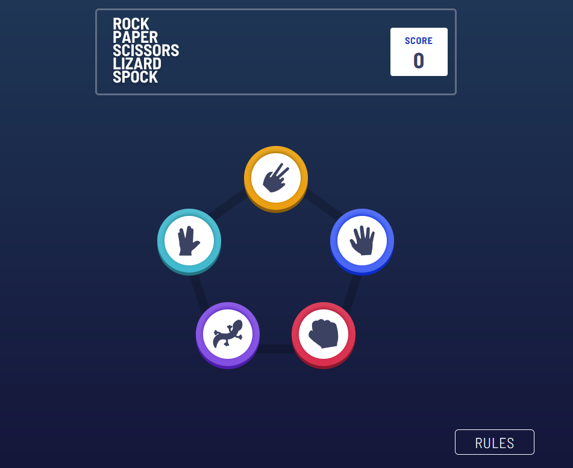
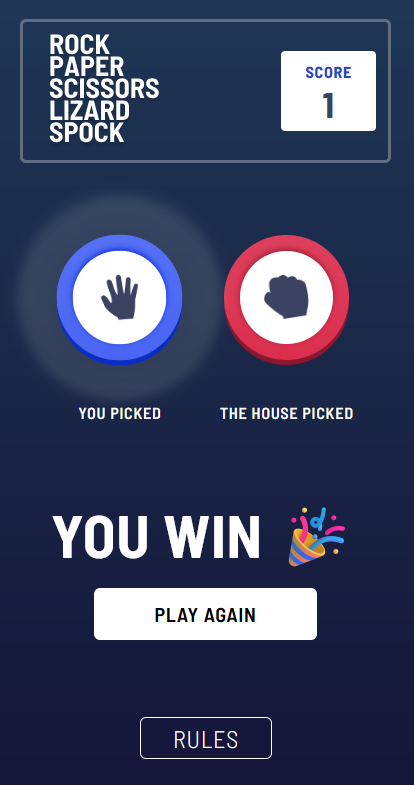

# Frontend Mentor - Rock, Paper, Scissors solution

This is a solution to the [Rock, Paper, Scissors challenge on Frontend Mentor](https://www.frontendmentor.io/challenges/rock-paper-scissors-game-pTgwgvgH). Frontend Mentor challenges help you improve your coding skills by building realistic projects. 

## Table of contents

- [Overview](#overview)
  - [The challenge](#the-challenge)
  - [Screenshot](#screenshot)
  - [Links](#links)
- [My process](#my-process)
  - [Built with](#built-with)
  - [Continued development](#continued-development)
- [Author](#author)

**Note: Delete this note and update the table of contents based on what sections you keep.**

## Overview

### The challenge

Users should be able to:

- View the optimal layout for the game depending on their device's screen size
- Play Rock, Paper, Scissors against the computer
- Maintain the state of the score after refreshing the browser _(optional)_
- **Bonus**: Play Rock, Paper, Scissors, Lizard, Spock against the computer _(optional)_

### Screenshot

### Links

- Solution URL: [https://github.com/StormKing969/rock-paper-scissors-game](https://github.com/StormKing969/rock-paper-scissors-game)
- Live Site URL: [https://rock-paper-scissors-with-ai-game.netlify.app/](https://rock-paper-scissors-with-ai-game.netlify.app/)

## My process

### Built with

- Semantic HTML5 markup
- CSS custom properties
- Flexbox
- TailwindCss
- Hugging Face AI
- [React](https://reactjs.org/) - JS library
- [Vite](https://vite.dev/) - React framework

### Continued development

I'd like to continue working on the game logic and also improve my CSS skills.

## Author

- Website - [Sajana Wijesinghe](https://sajana-wijesinghe-portfolio-v4.netlify.app/)
- Frontend Mentor - [@StormKing969](https://www.frontendmentor.io/profile/StormKing969)
- Twitter - [@SajanaW9](https://www.twitter.com/SajanaW9)